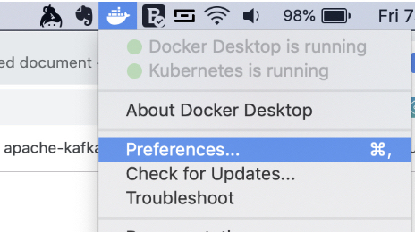
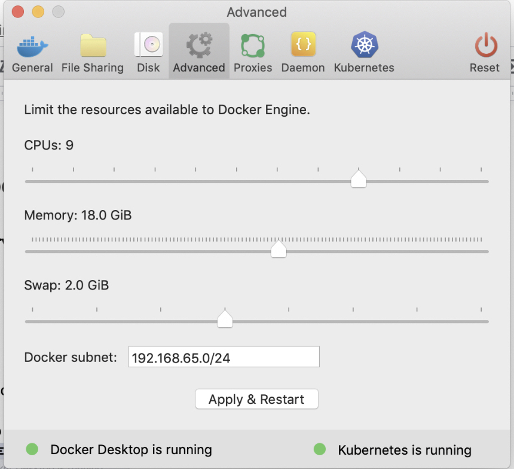
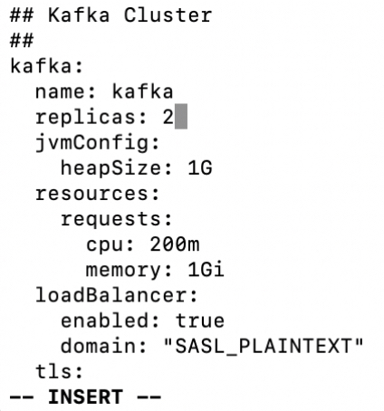
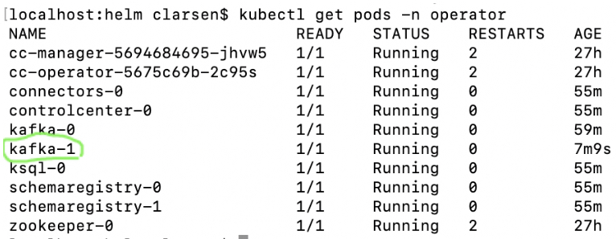
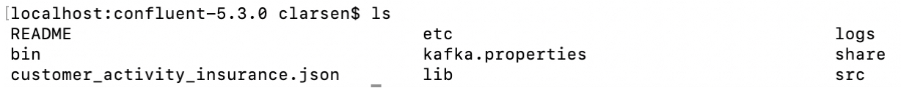

# TL:DR Guide to Local Operator on MacOS 

This guide is for those of us that want to do an initial demo Confluent Operator but do not want to have to spend a bunch of money on cloud resources and deal with the complexity of cloud implementations and do not live in k8s-land daily!

<span style="text-decoration:underline;">Bonus Magic</span>: **SSL_SASL** is enabled without having to create certs mapped to hostname, etc.


## <span style="text-decoration:underline;">Environment</span>: Docker for MacOS with Kubernetes enabled, *NOT minikube*


### Deps:


*   Helm  \
`brew install kubernetes-helm`

    ```
    helm init
    ```


*   Tiller \
`kubectl create serviceaccount tiller -n kube-system \
 \
kubectl create clusterrolebinding tiller \`

    ```
    --clusterrole=cluster-admin \
    --serviceaccount kube-system:tiller
    ```


     \
`helm init --service-account tiller` \


*   More resources given to Docker (+8-12GB RAM, +4 CPU)

    How to bump up Docker resources:



    Example working config on MacBook Pro 15 (32 GB),, Advanced tab


    


## Install Operator

Here is a link to the **private.yaml **file in this working configuration:

[https://raw.githubusercontent.com/derplarsen/localOperatorMac/master/private.yaml](https://raw.githubusercontent.com/derplarsen/localOperatorMac/master/private.yaml)

The following helm commands will install a pod by name (zookeeper, then kafka, etc) using the **yaml** file provided above:

**(Note - enter the `helm` directory inside of the base extracted confluent-operator directory before running these commands)**

Install Operator first:


```
    helm install \
    -f ./providers/private.yaml \
    --name operator \
    --namespace operator \
    --set operator.enabled=true \
    ./confluent-operator
```


Install Zookeeper:


```
    helm install \
    -f ./providers/private.yaml \
    --name zookeeper \
    --namespace operator \
    --set zookeeper.enabled=true \
    ./confluent-operator
```


Install Kafka:


```
    helm install \
    -f ./providers/private.yaml \
    --name kafka \
    --namespace operator \
    --set kafka.enabled=true \
    ./confluent-operator
```


Install Schema Registry:


```
    helm install \
    -f ./providers/private.yaml \
    --name schemaregistry \
    --namespace operator \
    --set schemaregistry.enabled=true \
    ./confluent-operator
```


Install Connectors:


```
    helm install \
    -f ./providers/private.yaml \
    --name connectors \
    --namespace operator \
    --set connect.enabled=true \
    ./confluent-operator
```


 \
Install Control Center:


```
    helm install \
    -f ./providers/private.yaml \
    --name controlcenter \
    --namespace operator \
    --set controlcenter.enabled=true \
    ./confluent-operator
```


Install KSQL:


```
    helm install \
    -f ./providers/private.yaml \
    --name ksql \
    --namespace operator \
    --set ksql.enabled=true \
    ./confluent-operator
```


## 


## How to Use the Cluster

Create a client configuration into a **kafka.properties** file on your host so that you can do stuff with a login:


```
    kubectl  -n operator  get kafka kafka -ojsonpath='{.status.internalClient}' > kafka.properties
```


Then copy that kafka.properties file over to the broker pod in kubernetes into the` /opt` directory:


```
    kubectl cp ./kafka.properties operator/kafka-0:/opt/kafka.properties
```


In order to log into the broker and execute `kafka-topics`, `kafka-console-producer`, etc, we can run the following:


```
    kubectl -n operator exec -it kafka-0 bash
```


Now that we are inside the pod we can run a test to see if our SSL / SASL plain encryption + ACL is enabled..


    _(First, we’ll need to set the local IP for the name resolution of “b0.SASL_PLAINTEXT”, do this by editing /etc/hosts and giving the non-127.0.0.1 ip address (mine is 192.168.1.12) of the laptop)_

Fire up a producer to send in some messages: \


```
    kafka-console-producer --producer.config <path to>/kafka.properties --broker-list b0.SASL_PLAINTEXT:9092 --topic test-topic
```


Start up another terminal session and log in to the same pod with the exec statement and run the console-consumer to check out the messages: \


```
    kafka-console-consumer --consumer.config <path to>/kafka.properties --bootstrap-server b0.SASL_PLAINTEXT:9092 --topic test-topic --from-beginning
```


## To allow connections from the outside

Create this services.yaml inside the providers directory:


```
    apiVersion: v1
    kind: Service
    metadata:
      name: kafka-service
    spec:
      selector:
        app: kafka
      ports:
        - name: broker
          protocol: TCP
          port: 9092
          targetPort: 9092
        - name: bootstrap
          protocol: TCP
          port: 9071
          targetPort: 9071
        - name: c3
          protocol: TCP
          port: 9021
          targetPort: 9021
```


_(..you may want to add more ports for ksql, etc.)_

Then run this:


```
    kubectl apply -f providers/services.yaml
```


Then patch it to expose the external IP for your laptop IP address:


```
    kubectl patch svc kafka-service -p '{"spec":{"externalIPs":["192.168.1.12"]}}'
```


You should now be able to access `http://<your.ip>:9021` for controlcenter.


## Demonstrate Adding a Broker Node

Open the` providers/private.yaml`, change replicas to ***<code>2</code></strong>*





Then run the following to upgrade kafka to 2 brokers \


```
    helm upgrade \
    -f ./providers/private.yaml \
    --set kafka.enabled=true \
    kafka \
    ./confluent-operator
```


## When you run kubectl get pods -n operator you’ll now see that you have another broker available





NOTE: It’s worth showing that when you provide the component version with this additional flag, it will pull down the new image and upgrade to the latest version. This will be possible to demonstrate later when more versions become available, but for now we can just highlight it.


```
    helm upgrade \
    -f ./providers/private.yaml \
    --set kafka.enabled=true \
    --set kafka.image.tag=<new-version-#> kafka \
    ./confluent-operator
```


(...and you can do the same for zookeeper, controlcenter, ksql, schema-registry)


## Monitoring with Prometheus (coming soon)

..


Demonstrate Resilience (?)


1. Initiate a kafka-producer-perf-test
    1. Go to a directory containing the extracted Confluent tarball (latest is good, not super important).. If you’re in the appropriate folder it will look like this (without the json): \



2. Download json from here: 
[https://raw.githubusercontent.com/confluentinc/demo-scene/master/industry-themes/next_best_offer_insurance/data/customer_activity_insurance.json](https://raw.githubusercontent.com/confluentinc/demo-scene/master/industry-themes/next_best_offer_insurance/data/customer_activity_insurance.json)

3. Run the following:

```
    ./bin/kafka-producer-perf-test \
      --topic CUSTOMER_ACTIVITY_STREAM \
      --throughput 1 \
      --producer-props bootstrap.servers=b0.SASL_PLAINTEXT:9092 \
      --payload-file customer_activity_insurance.json \
      --num-records 100000
```


2. Show in C3 how message are flowing through
3. Break a broker
4. Watch it come back
5. Show how no messages are lost


## Tear it all down

```
helm delete --purge ksql
helm delete --purge controlcenter
helm delete --purge connect
helm delete --purge replicator
helm delete --purge schemaregistry
helm delete --purge kafka
helm delete --purge zookeeper
helm delete --purge operator
